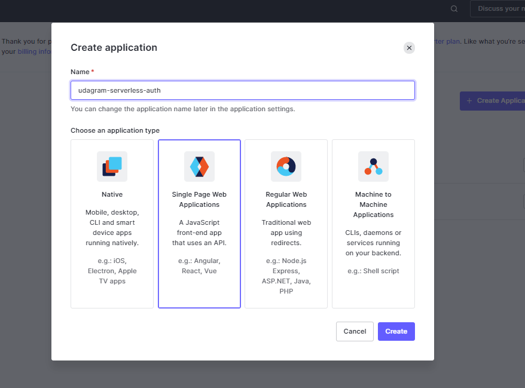
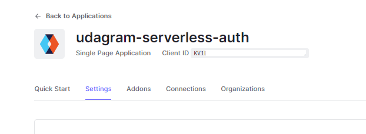
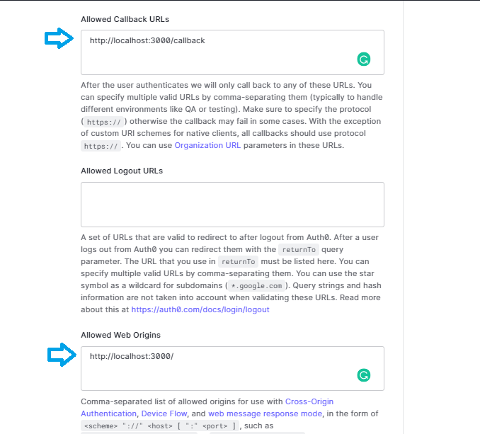
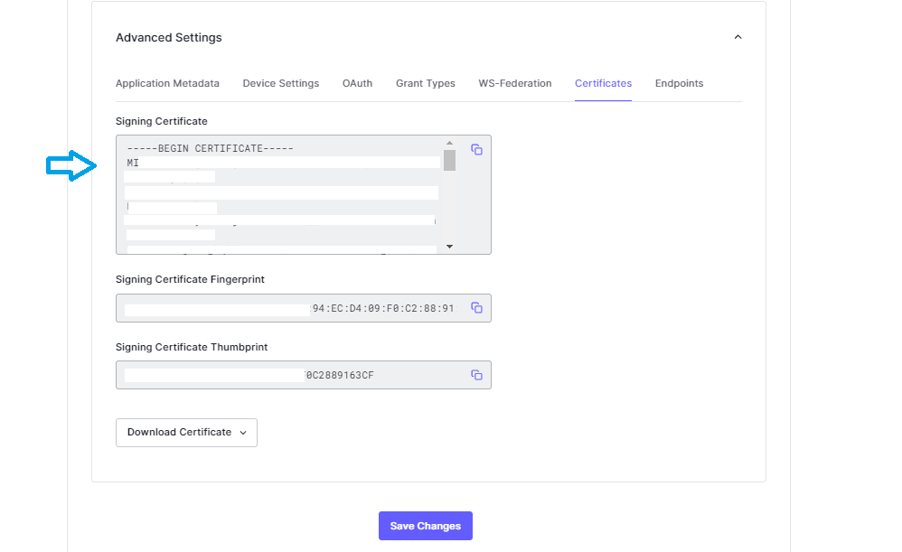

# Udagram Serverless

A serveless application built using NodeJs, Typescript, AWS & Serverless framework, which allows users to create groups and upload images to a group.

## installation

```bash
# Clone this repo (use HTTPS if you didn't setup SSH)
~ git clone git@github.com:oussamabouchikhi/udagram-serverless-auth.git
# CD into the app folder
~ cd udagram-serverless-auth
# Install dependencies
~ npm i
# Rename example.env to .env and update your credentials
~ mv example.env .env
```

## Other usefull commands

In order for your aws resources to be updated make sure to run this command after any update to your local machine.

```bash
~ sls deploy -v
```

And also make sure to install serverless globally to be able to run `sls` commands

```bash
~ npm i -g serverless
```

## Usage 📋

<details open>
<summary>Setup Auth0</summary>

### Create a new app



### Add callback url & allowed origin




### Copy certificate



and then paste it in **.env** folder

```
AUTH0_CERTIFICATE=PASTE_IT_HERE
```

</details>


## Features

- implemrnt authentication
- Authenticate requests with AWS Lambda
    - IAM, Cognito integration, custom authorizer
- Custom authorizer
    - Using Auth0
    - OAuth and OpenID
- Store secrets in AWS
    - Using Middy middleware